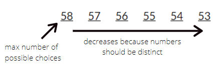

# Second Markdown Assignment
1. #The Monty Hall Problem

2. #PCSO Ultra Lotto 6/58

The PCSO Ultra Lotto 6/58 is played by choosing six numbers from 1-58.
If one person were to buy all the tickets to ensure winning the ₱50 million jackpot, they would incur a massive loss since there are 29,142,257,760 possible combinations.Even if one ticket costs ₱1, it would still leave the buyer at a major loss.

The figure above shows how the probability of winning the PCSO Ultra Lotto 6/58 was achieved. This means that the chance of winning is 1/29,142,257,760 or roughly 0.0000000000343%. Buying all of the tickets would mean spending ₱582,845,155,200.00